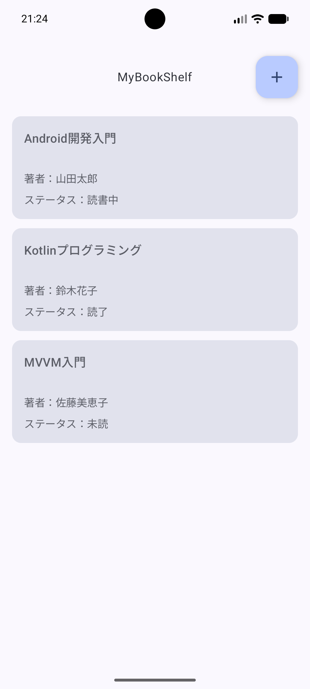
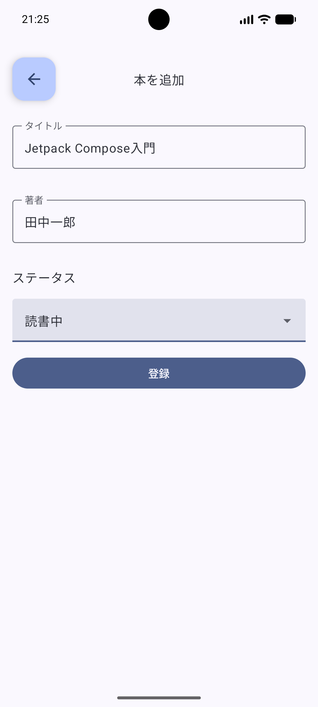
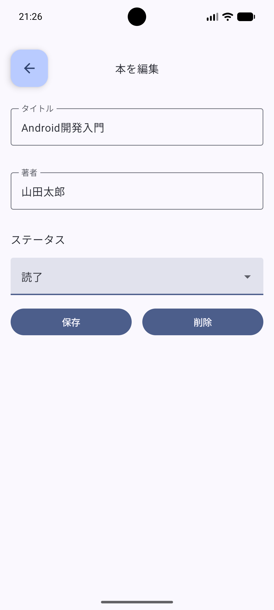

# MyBookShelf

Android向けの本管理アプリです。

本の登録・一覧表示・編集・削除を行うことができ、
読書ステータスとして「未読」「読書中」「読了」を管理できます。

KotlinとJetpack Composeを使用し、ViewModel、StateFlow、Kotlin Coroutines、Roomなどを用いて実装しています。

Androidアプリ開発におけるUI構築、状態管理、非同期処理、データ永続化などの理解を深めることを目的として個人開発しました。


## 主な機能

- 本の登録
    - タイトル
    - 著者
    - 読書ステータス（未読・読書中・読了）
- 本の一覧表示
- 本の編集
- 本の削除
- 削除確認ダイアログ
- タイトル・著者の入力チェック
- 本追加画面表示時の入力状態初期化
- 追加・編集・削除完了後の画面遷移
- 入力画面のスクロール対応
- Enter操作による次の入力項目への移動
- Roomによるデータの永続化


## 使用技術

| 技術                 | 用途                |
|--------------------|-------------------|
| Kotlin             | Androidアプリ開発      |
| Jetpack Compose    | UI構築              |
| Material 3         | UIコンポーネント         |
| ViewModel          | 画面状態・処理の管理        |
| StateFlow          | UI状態の管理           |
| Kotlin Coroutines  | 非同期処理             |
| Room               | ローカルデータベース・データ永続化 |
| Navigation Compose | 画面遷移              |
| Git / GitHub       | バージョン管理・ソースコード管理  |


## アーキテクチャ

MVVMをベースとした構成で実装しています。

```text
Jetpack Compose UI
        ↓
    ViewModel
        ↓
    Repository
        ↓
      DAO
        ↓
   Room Database
```

### UI

Jetpack Composeを使用して画面を構築しています。

本一覧画面、本追加画面、本編集画面に分けてUIを構成しています。

### ViewModel

`BookViewModel`を作成し、画面の状態管理や本の登録・更新・削除処理を行っています。

### StateFlow

`BookUiState`を作成し、タイトル・著者・ステータス・入力エラーなどのUI状態を`StateFlow`で管理しています。

### Repository

`BookRepository`を作成し、ViewModelとDAOの間に配置しています。

ViewModelから直接DAOを操作せず、Repositoryを経由してデータアクセスを行う構成にしています。

### DAO

`BookDao`を作成し、Roomを利用した本の登録・取得・更新・削除処理を担当しています。

### Room Database

`BookEntity`、`BookDao`、`AppDatabase`を作成し、Roomを利用して本のデータをローカルデータベースに保存しています。

アプリを再起動しても登録した本が保持されます。


## 画面構成

### 本一覧画面

登録されている本を一覧表示します。

本をタップすると本編集画面へ、
＋ボタンをタップすると本追加画面へ遷移します。

本のタイトル・著者・ステータスをCard形式で表示しています。



### 本追加画面

タイトル・著者・読書ステータスを入力して本を登録します。

タイトル・著者の入力チェックを行い、
入力エラーがある場合は画面にエラーを表示します。

登録完了後は本一覧画面へ戻ります。



### 本編集画面

登録済みの本のタイトル・著者・読書ステータスを編集できます。

保存または削除を行うことができます。

削除時には確認ダイアログを表示し、
削除完了後は本一覧画面へ戻ります。




## 主な実装内容

### ViewModel + StateFlowによる状態管理

`BookUiState`を作成し、タイトル・著者・ステータス・入力エラーなどのUI状態を`BookViewModel`の`StateFlow`で管理しています。

Compose側ではStateFlowを購読し、状態の変更をUIへ反映しています。


### Coroutine + suspendによる非同期処理

Roomへの本の登録・更新・削除処理にKotlin Coroutinesと`suspend`を利用しています。

DB操作完了後に`onComplete`を実行し、
DB処理が完了してから画面遷移するようにしています。


### Roomによるデータ永続化

Roomを利用して本の登録・取得・更新・削除を実装しています。

アプリを再起動しても登録した本が保持されるよう、
ローカルデータベースへデータを保存しています。


### Repositoryによるデータアクセス処理の分離

`BookRepository`を作成し、
ViewModelとDAOの責務を分離しています。

```text
BookViewModel
      ↓
BookRepository
      ↓
BookDao
      ↓
Room
```


### Navigation Composeによる画面遷移

Navigation Composeを利用して、
本一覧・本追加・本編集の画面遷移を実装しています。


## 工夫した点

- UIとデータアクセス処理を分離するため、ViewModelとRepositoryを使用しました。
- `StateFlow`を利用してUI状態を一元管理し、Composeから状態を購読する構成にしました。
- RoomへのDB操作にはCoroutineと`suspend`を利用し、DB操作完了後に画面遷移するようにしました。
- タイトル・著者の未入力時にはエラーを表示し、入力内容を修正できるようにしました。
- 本追加画面を表示する際にUI状態を初期化し、前回の入力内容が残らないようにしました。
- 削除時には確認ダイアログを表示し、誤操作を防止するようにしました。
- 入力画面にスクロール処理を実装し、Enter操作で次の入力項目へ移動できるようにしました。


## データフロー

本の登録・編集・削除では、以下の流れでデータを処理しています。

### 本の登録

```text
BookAddScreen
      ↓
BookViewModel
      ↓
BookRepository
      ↓
BookDao
      ↓
Room Database
      ↓
DB処理完了
      ↓
画面遷移
      ↓
BookListScreen
```

### 本の編集

```text
BookEditScreen
      ↓
BookViewModel
      ↓
BookRepository
      ↓
BookDao
      ↓
Room Database
      ↓
DB処理完了
      ↓
画面遷移
      ↓
BookListScreen
```

### 本の削除

```text
BookEditScreen
      ↓
削除確認ダイアログ
      ↓
BookViewModel
      ↓
BookRepository
      ↓
BookDao
      ↓
Room Database
      ↓
DB処理完了
      ↓
画面遷移
      ↓
BookListScreen
```


## 今後の改善点

- 登録・編集・削除後の完了メッセージ表示
- 本の検索機能
- 本の並び替え機能
- 本の表紙画像の登録
- 読書進捗率の管理
- テストコードの追加